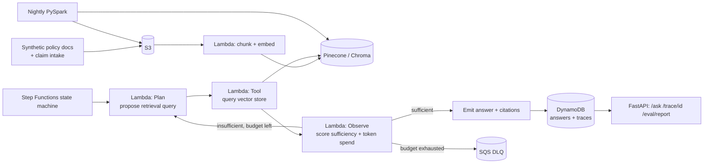

# Architecture

## Data flow notes

- The loop (`Plan → Tool → Observe → Choice`) is a Step Functions `Map`/`Choice` construct — the budget counter lives in DynamoDB so it survives across Lambda invocations.
- `Observe` is the only step that can end the loop early (sufficient evidence) or route to the DLQ (budget exhausted) — it is the safety valve.
- The nightly PySpark job re-embeds only documents that changed, keeping the vector store fresh without a full daily re-index.
