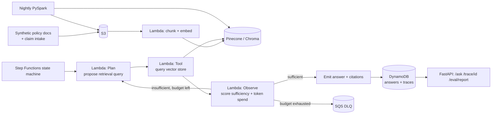

# Architecture

## ASCII — execution flow

```
  synthetic policy docs + claim intake
             |
             v
           S3 (claims-docs)
             |
             v
  src/ingestion/index_docs.py
    chunk + embed (sentence-transformers)
             |
             v
     Pinecone / Chroma (flag: chroma local)
             |
             v
  src/orchestration/statemachine.py  -- drives the loop, calls into --> src/models/agent_loop.py
    (Plan / Tool / Observe run in Python here — an embedding model
     call doesn't fit a bare Lambda runtime)
             |
      +------+-------------------------------------+
      |                                             |
      v                                             |
  Plan: propose retrieval query from claim           |
      |                                             |
      v                                             |
  Tool: query vector store, top-k  <------------------+ (loops back on retry)
      |
      v
  Observe: score evidence sufficiency
      |
      v
  Gate (Lambda): src/orchestration/lambdas/check_budget.py
    atomic DynamoDB token-spend check
      |
   +--+--------------------+
   |                       |
 sufficient           insufficient
   |                       |
   v                       v
 emit answer          budget left? --no--> Lambda: send_to_dlq.py --> SQS DLQ
 + citations               |
   |                      yes (retry Plan)
   v
 DynamoDB (answers + traces)
             |
             v
  nightly src/transformation/reindex.py (PySpark)
    re-embed only changed docs, archive traces --> S3 Parquet
             |
             v
  src/serving/api.py :: FastAPI
    /ask  /trace/{id}  /eval/report
```

## Mermaid (same flow)



## Data flow notes

- The loop (`Plan → Tool → Observe → Choice`) is a Step Functions `Map`/`Choice` construct — the budget counter lives in DynamoDB so it survives across Lambda invocations.
- `Observe` is the only step that can end the loop early (sufficient evidence) or route to the DLQ (budget exhausted) — it is the safety valve.
- The nightly PySpark job re-embeds only documents that changed, keeping the vector store fresh without a full daily re-index.
